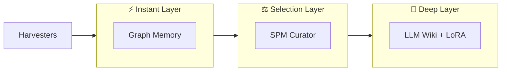

<p align="center">
  
</p>

# the-brain — open memory platform for AI

**[the-brain.dev](https://the-brain.dev)**

> 🧪 **Experimental — pre-alpha. Far from stable.** the-brain explores what happens when AI has persistent, private, 3-layer memory. Breaking changes, missing features, and rough edges are the norm right now. If you're curious about the concept, [contribute](CONTRIBUTING.md) or [build an extension](https://the-brain.dev/docs/customization/extensions). Production use is not yet recommended.

[](LICENSE)
[](https://bun.sh)
[](https://www.typescriptlang.org/)
[](https://github.com/the-brain-dev/Brain)

**the-brain** is an extension-first platform that observes your interactions with AI tools and builds a persistent, private memory tailored to **you**.

We don't force a single memory type. Instead, the-brain acts as a **pluggable cognitive host**, connecting various memory modules (Graph, Vector, LoRA) into one cohesive pipeline — all replaceable, all local.

## Table of Contents

- [Quick Start](#-quick-start)
- [CLI Usage](#-cli-usage)
- [Tech Stack](#-tech-stack)
- [Packages](#-packages)
- [Building Your Own Plugin](#-building-your-own-plugin)
- [Documentation](#-documentation)
- [Contributing](#-contributing)
- [License](#-license)

## The Concept: A Modular 3-Layer Cognitive Architecture

the-brain implements a pluggable 3-layer memory system:



### ⚡ Instant Layer (Working Memory)

Injects context **before every prompt**.

**Examples:**
- Recent interactions from the current session
- Currently edited file and project context
- Recent corrections and user preferences
- Active graph nodes (Graph Memory)
- Daemon state and loaded plugins

### ⚖️ Selection Layer (Gatekeeper)

Evaluates interactions for surprise and decides what to promote to Deep.

**Examples:**
- Interactions with high `surprise_score`
- Explicit corrections and preferences
- Novel concepts and entities
- Patterns recurring across sessions
- Signals worth permanent storage (promote)

### 🌌 Deep Layer (Long-Term Memory)

Permanent consolidation of knowledge in human- and model-readable form.

**Examples:**
- **LLM Wiki** — automatically generated knowledge base (markdown + links)
- Trained LoRA adapters
- **Skill Forge** — automatic skill proposal and generation from graph patterns
- User identity vector / model fingerprint
- Long-term cross-project patterns

### Harvesters (Data Sources)

- `plugin-harvester-hermes`
- `plugin-harvester-cursor`
- `plugin-harvester-claude`
- `plugin-harvester-gemini`
- `plugin-harvester-lm-eval`

## 🚀 Quick Start

### Prerequisites

- **Bun** installed (`curl -fsSL https://bun.sh/install | bash`)
- (Optional) macOS Apple Silicon + `uv` for MLX LoRA training

### Installation

```bash
# One-liner install
curl -fsSL https://the-brain.dev/install.sh | bash

# Or install from source
git clone https://github.com/the-brain-dev/Brain.git
cd Brain
./install.sh
```

## 💻 CLI Usage

```bash
# Initialize database and config
the-brain init

# Start the background daemon
the-brain daemon start

# Check what your brain learned
the-brain inspect --stats

# Force a memory consolidation (Layer 2 → Layer 3)
the-brain consolidate --now

# List loaded plugins
the-brain plugins list

# Switch active context/project
the-brain switch-context --project my-app
```

### Development

```bash
bun install          # Install all dependencies
bun test             # Run tests with coverage
bun run lint         # Lint and format check
bun run format       # Auto-fix formatting
./test.sh            # Run tests without API keys
bun run cli          # Run CLI from source
bun run daemon       # Run daemon from source
```

## 🛠 Tech Stack

- **Core Orchestrator:** TypeScript, Bun, `cac`, `hookable`
- **State Management:** Drizzle ORM + native `bun:sqlite`
- **Optional ML Sidecar:** Python, `uv`, `mlx-lm` (Apple Silicon)
- **Testing:** Bun test runner, >80% coverage target
- **Linting/Formatting:** Biome

## 📦 Packages

| Package | Description |
|---------|-------------|
| **@the-brain-dev/core** | Types, hooks, plugin manager, database layer |
| **@the-brain-dev/plugin-graph-memory** | Instant memory layer with relation graphs |
| **@the-brain-dev/plugin-spm-curator** | Surprise-gated prediction error filtering |
| **@the-brain-dev/plugin-harvester-cursor** | Cursor IDE log reader |
| **@the-brain-dev/plugin-harvester-claude** | Claude Code log reader |
| **@the-brain-dev/plugin-harvester-hermes** | Hermes Agent log reader |
| **@the-brain-dev/plugin-harvester-gemini** | Gemini CLI log reader |
| **@the-brain-dev/plugin-harvester-lm-eval** | Benchmark result harvester |
| **@the-brain-dev/plugin-identity-anchor** | Stable self-vector across retrains |
| **@the-brain-dev/plugin-auto-wiki** | Weekly static wiki from learned knowledge |
| **@the-brain-dev/trainer-local-mlx** | Local LoRA training on Apple Silicon |

## 🔌 Building Your Own Plugin

```typescript
import { definePlugin, HookEvent } from '@the-brain-dev/core';

export default definePlugin({
  name: 'my-custom-memory',
  version: '1.0.0',
  setup(hooks) {
    hooks.hook(HookEvent.BEFORE_PROMPT, async (context) => {
      const extraKnowledge = await myVectorSearch(context.prompt);
      context.inject(extraKnowledge);
    });
  },
});
```

See [Writing Plugins](https://the-brain.dev/docs/customization/writing-plugins) for the full plugin authoring guide.

> **Extensions** are lightweight, single-file scripts that don't need a rebuild — but they're **disabled by default**. Enable them in `config.json`: `"extensions": ["name"]`.

## 📚 Documentation

Full documentation at **[the-brain.dev](https://the-brain.dev)**.

- [the-brain.dev/docs](https://the-brain.dev/docs) — Full documentation (architecture, plugins, configuration, MLX training)
- [AGENTS.md](AGENTS.md) — Rules for AI agents working on this project
- [CONTRIBUTING.md](CONTRIBUTING.md) — Contribution guidelines

## 🤝 Contributing

the-brain is actively seeking contributors. Start here:

1. Read [CONTRIBUTING.md](CONTRIBUTING.md)
2. Pick a [`good first issue`](https://github.com/the-brain-dev/Brain/issues?q=is%3Aissue+is%3Aopen+label%3A%22good+first+issue%22)
3. Open a [discussion](https://github.com/the-brain-dev/Brain/discussions) to scope your work before coding

We especially welcome **harvesters** for new data sources (Windsurf, Gemini CLI, terminal history) and documentation improvements.

**Before submitting a PR:**
```bash
bun test --coverage     # >80% line coverage
bun run lint            # zero errors
cd apps/docs && bun run build  # docs compile clean
```

## 📄 License

MIT License © 2026

---

> "The brain is a muscle that can be extended with code."
