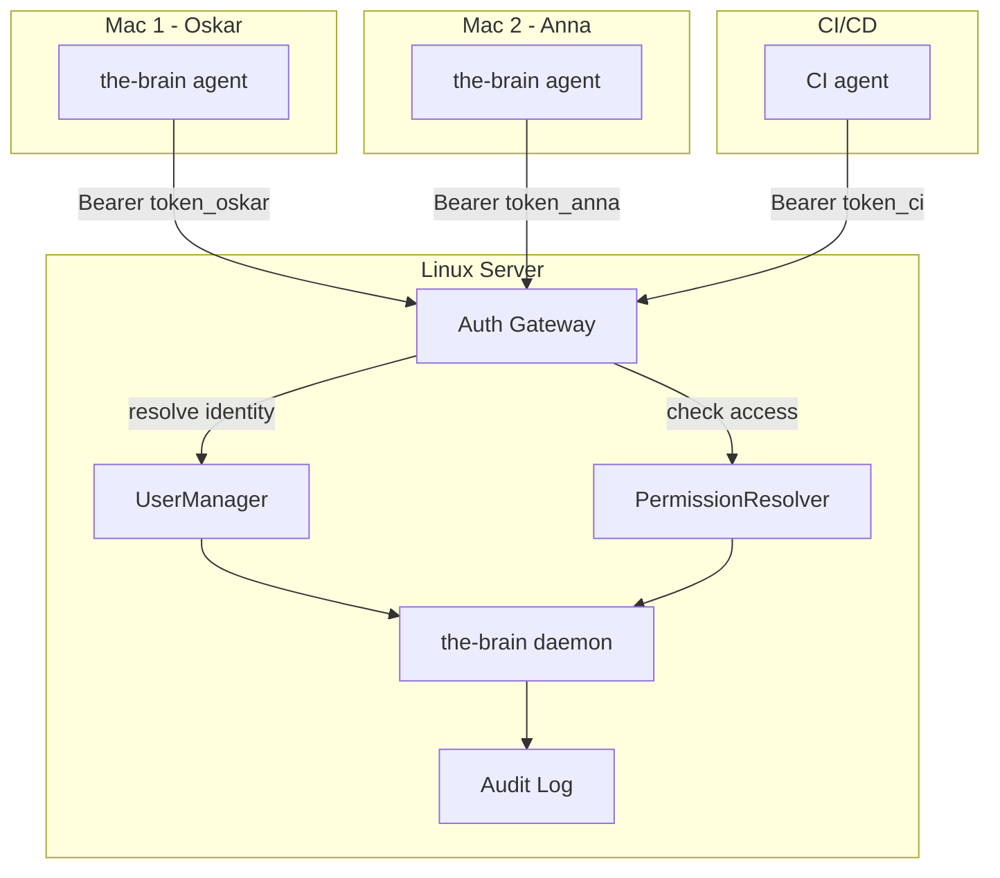

> **Status:** Planned — implementation in progress. See the [architecture proposal](https://github.com/the-brain-dev/Brain/blob/main/references/team-mode-architecture.md) for full design details.

Team mode extends the-brain's remote mode to support multiple developers and autonomous agents sharing a single brain server. Each user gets their own token, identity, and permissions — allowing the brain to learn per-developer preferences while building shared team patterns.

## Why Team Mode?

Single-user remote mode works: one developer, one daemon. But when a team of 5 developers all work on the same codebase, you want the brain to know:

- **Who** made a correction (Oskar prefers tabs, Anna prefers spaces)
- **What** is a team convention vs personal preference (use Redux = team, use xdist = Oskar)
- **When** patterns emerge across the team (both Oskar and Anna independently fixed the same bug pattern)

## Architecture



## Setup

### 1. Server (Linux)

```bash
# Initialize in team mode
the-brain init --remote --team

# Creates:
#   - Default admin user
#   - config.json with server.mode = "team"
#   - users.db alongside brain.db

# Start daemon
the-brain daemon start
```

### 2. Add Team Members

```bash
# Add a developer to the cpv project
the-brain user add --name anna --project cpv --role contributor

# Output:
#   ✓ User "anna" created
#   API Token: mb_a1b2c3d4e5f6...

# Generate additional tokens (e.g., for CI)
the-brain user token --name anna --label "CI Server"
```

### 3. Client Setup (macOS)

```bash
# Each developer sets their own token
export THE_BRAIN_REMOTE_URL="http://<server-ip>:9420"
export THE_BRAIN_AUTH_TOKEN="mb_a1b2c3d4e5f6..."

# Start push agent
the-brain agent
```

## Permission Model

Roles are assigned per project. A user can be an admin on one project and a contributor on another.

| Role | Read | Push interactions | Consolidate | Train | Manage users |
|------|------|-------------------|-------------|-------|--------------|
| **admin** | ✅ | ✅ | ✅ | ✅ | ✅ |
| **contributor** | ✅ | ✅ | ❌ | ❌ | ❌ |
| **observer** | ✅ | ❌ | ❌ | ❌ | ❌ |

## How Context Injection Works

When Oskar opens a session on project CPV, the brain injects context in this order:

1. **Identity anchor** — Oskar's stable self-vector (preferences, coding style)
2. **Personal memories** — Oskar's own corrections and preferences on CPV
3. **Team memories** — Shared patterns detected across the team on CPV
4. **Global overrides** — Cross-project patterns (e.g., "always use TypeScript")

This means Anna's preference for tabs doesn't leak into Oskar's sessions, but the team convention "use Redux for state management" is injected for both.

## CLI Reference

```bash
# User management (admin only)
the-brain user add --name <name> --project <project> [--role admin|contributor|observer]
the-brain user list [--project <project>]
the-brain user remove --name <name>
the-brain user set-role --name <name> --project <project> --role <role>

# Token management
the-brain user token --name <name> [--label "My MacBook"]
the-brain user token --revoke <token-id>

# Audit
the-brain audit [--userId <id>] [--project <project>] [--limit 50]
```

## API Endpoints

All endpoints require admin authentication.

```
POST   /api/users                          # Create user
GET    /api/users                          # List users
DELETE /api/users/:id                      # Remove user
POST   /api/users/:id/tokens               # Generate new token
GET    /api/users/:id/tokens               # List user's tokens
DELETE /api/users/:id/tokens/:tid           # Revoke token
GET    /api/audit-log?userId=&project=&limit=  # Query audit trail
```

## Future

- **SSO/OAuth** — Google, GitHub OAuth as authentication providers
- **Rate limiting** — Per-user request quotas
- **Team dashboard** — Web UI showing team activity, active users, consolidation status
- **Shared training** — Team-wide LoRA adapters composed with per-user adapters
- **LDAP integration** — Enterprise directory support

## See Also

- [Remote Mode](/docs/integrations/remote-mode) — Single-user remote setup
- [MCP Server](/docs/integrations/mcp-server) — MCP protocol integration
- [Architecture proposal](https://github.com/the-brain-dev/Brain/blob/main/references/team-mode-architecture.md) — Full design document
